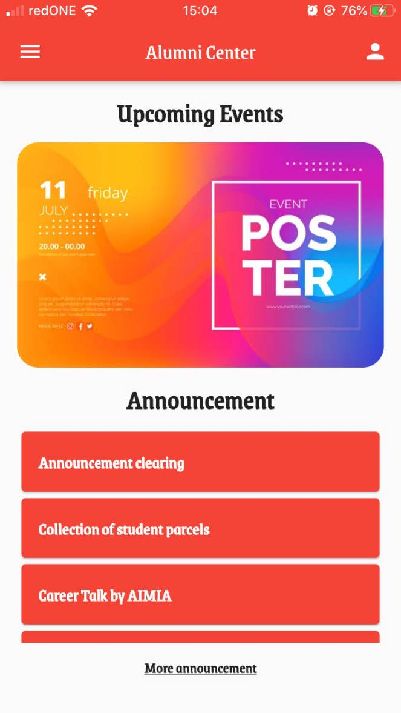

# Alumni-Center
Alumni Center is an Alumni Management System (AMS). AMS is a medium for the university to communicate and keep track of its graduates. Today, universities have their own alumni management systems (AMS) to manage data and details of their alumni. 

Here we proposed a new AMS built using Flutter framework with various functions like job listing, user event management, announcement management, feedback system and others. The backend server is using PHP and we host it on hostinger.com

## Screenshots of our app

  
  
  
  

  
  
  
  

## Notes
Since our project is submitted, we do not continue the hosting plan on hostinger.com and thus, the server is no longer functioning and the apk is not working now.
